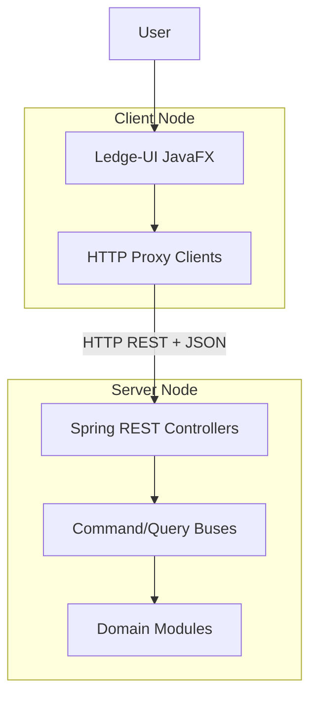
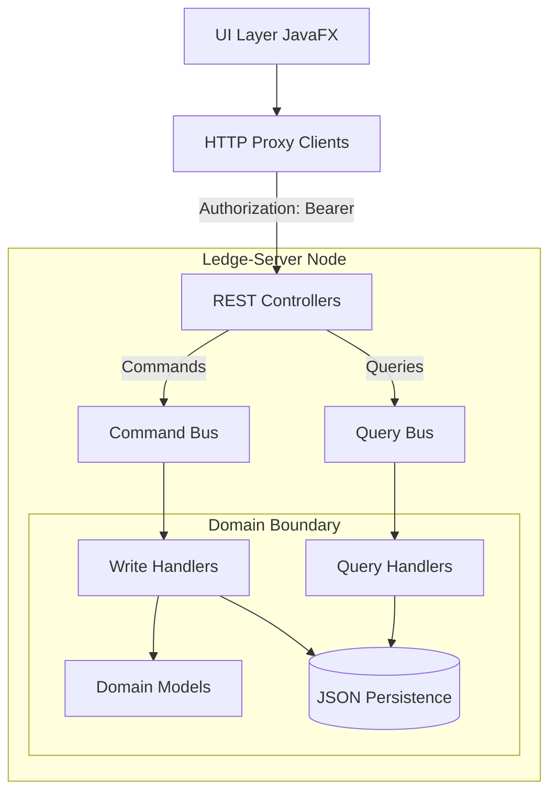
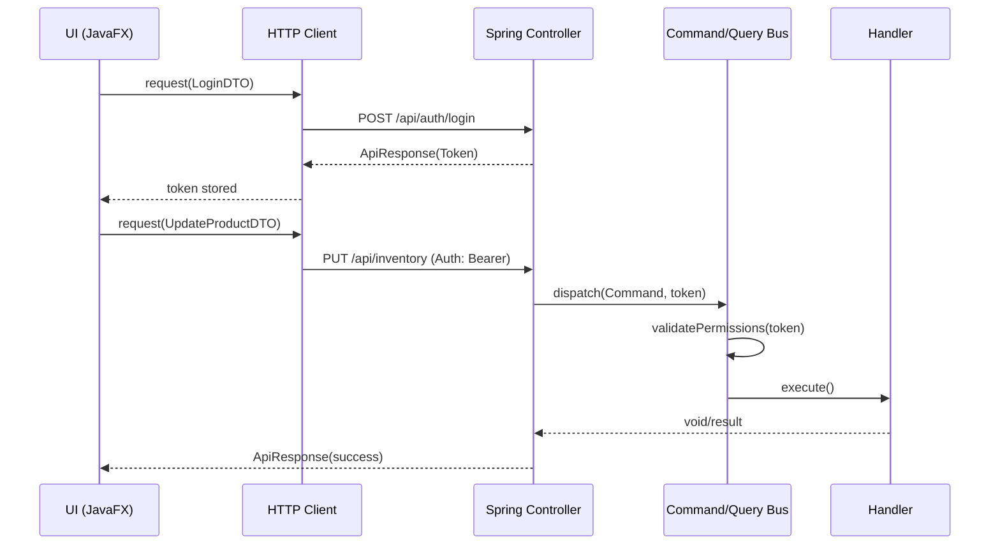

# System Architecture: Ledge Inventory Manager

This document outlines the architectural design of the Ledge Inventory Manager after its transition to a **Client-Server Distributed Architecture** using Spring Boot and JavaFX.

## 1. Architectural Philosophy

The system is designed with a strong focus on separation of concerns, utilizing a decoupled infrastructure to ensure the frontend and backend can evolve independently:

*   **Distributed Client-Server**: The application is split into a standalone REST API (Server) and a desktop client (UI), communicating exclusively over HTTP.

*   **Contract-First Design**: Communication between layers is governed by dedicated Contract DTOs, ensuring binary independence between the client and the server internals.

*   **Command Query Responsibility Segregation (CQRS)**: Strict separation between state-mutating operations (Commands) and data-retrieval operations (Queries) within the server.

*   **Spring-Powered Backend**: The server utilizes Spring Boot for dependency injection, REST orchestration, and lifecycle management, replacing the legacy manual `ModuleRegistry`.

---

## 2. System Overview

One glance architecture diagram:

### Detailed Component Flow

---

## 3. Physical Module Breakdown

The project is structured as a Maven multi-module reactor with three distinct physical artifacts:

### `ledge-contracts`

The shared binary foundation. Contains only data and service definitions that both sides must agree on.

*   **DTOs**: All API Request and Response objects.

*   **Core Logic**: Shared infrastructure like the `EventBroker` and core security types (`Role`, `Permission`).

*   **Zero Dependencies**: This module has no dependencies on Spring or JavaFX to remain as small as possible.

### `ledge-server`

A standalone Spring Boot application providing the business logic and persistence.

*   **REST Controllers**: Expose the domain to the network, translating HTTP headers (Tokens) into `AuthContext`.

*   **CQRS Interior**: Houses the Command/Query buses and all domain handlers.

*   **In-Memory DB**: Manages the JSON-based persistence layers for Users and Inventory.

### `ledge-ui`

The JavaFX desktop client.

*   **HTTP Adapters**: Contains `HttpAuthClient`, `HttpInventoryClient`, etc., which proxy the UI's requests over the network.

*   **Presentation**: Pure FXML-based views and ViewModels for user interaction.

*   **Decoupled**: Has zero knowledge of the server's domain logic or database structure.

---

## 4. The Network Boundary

The most critical architectural rule in the current system is the physical network boundary. 

*   **DTO Exclusivity**: No server-side Domain Models (`Product`, `User`) are ever serialized. Communication is performed strictly via `ledge-contracts` DTOs.

*   **Identity via Headers**: The client never sees the server's session state. It simply persists a Token and provides it in the `Authorization: Bearer <token>` header for every request.

*   **Serialization**: All network payloads are serialized using **Gson**, ensuring consistent behavior across the boundary.

---

## 5. Security & Authorization

Security remains fundamentally integrated into the Server-side dispatch infrastructure.

*   **Token-Based**: Upon login, the Server returns a token string. The Client stores this in the `SessionManager`.

*   **Bus-Level Guards**: Even if an endpoint is called via REST, the internal `CommandBus` and `QueryBus` re-verify permissions against the `AuthorizationService` before executing any logic.

*   **Exception Mapping**: Server-side `AuthorizationException` is automatically translated to HTTP 403 Forbidden by a `GlobalExceptionHandler`, allowing the UI to react (e.g., showing a "Permission Denied" notification).

### Distributed Token Flow

---

## 6. Explicit Architectural Rules

1.  **Strict Module Isolation**: The `ledge-ui` module MUST NOT depend on `ledge-server`. It only interacts via the `ledge-contracts` and network calls.

2.  **Stateless API**: The Server must not rely on HTTP Sessions. Every request must be self-describing via the Authorization header.

3.  **Unified Results**: Every API response must be wrapped in the `ApiResponse<T>` envelope to provide a consistent error-handling contract for the UI.

4.  **No Direct DB Access**: Only the `ledge-server` is allowed to touch the `data/` directory. The UI has zero filesystem knowledge of the database.