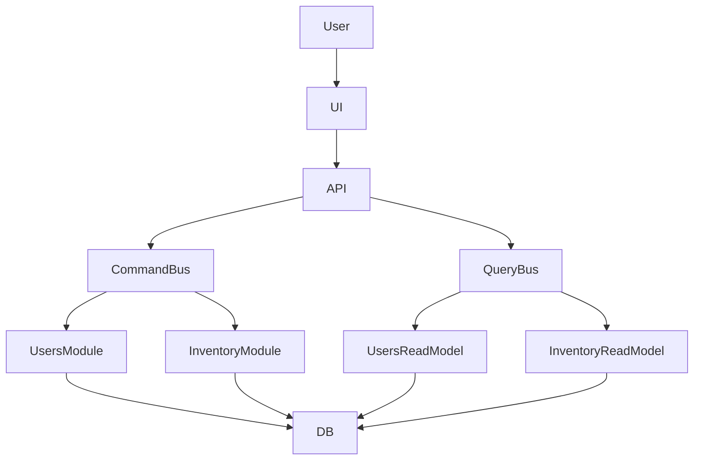
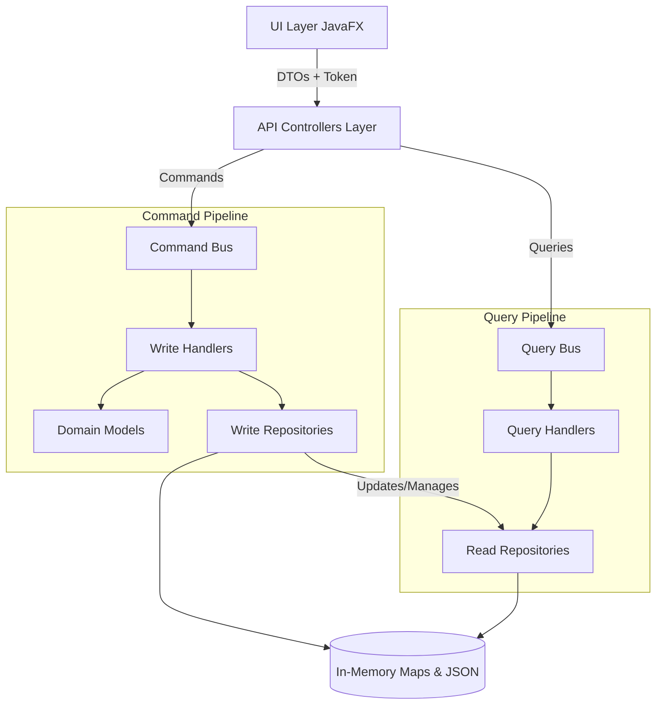
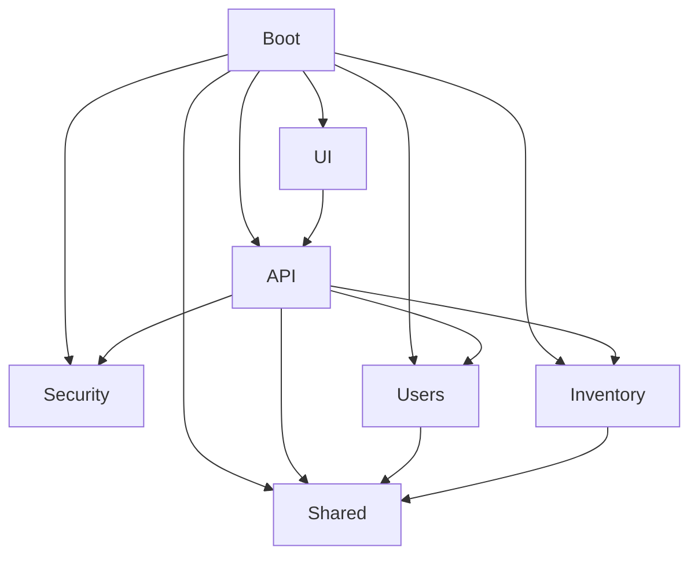
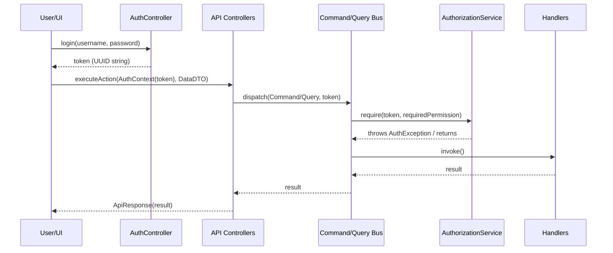

# System Architecture: Ledge Inventory Manager

This document outlines the architectural design of the Ledge Inventory Manager following its transition to a modular, API-driven, and CQRS-based system.

## 1. Architectural Philosophy

The system embraces several modern architectural patterns to ensure scalability, maintainability, and domain separation:

*   **Modular Monolith**: Code is organized by bounded contexts (Modules) rather than technical layers. Each module encapsulates its own domain, infrastructure, and application logic.

*   **Command Query Responsibility Segregation (CQRS)**: Strict separation between state-mutating operations (Commands) and data-retrieval operations (Queries).

*   **API Gateway Pattern**: The UI does not interact with the domain boundaries directly. Instead, an API layer provides a well-defined boundary, routing requests and returning DTOs.

*   **Custom Dependency Injection**: A lightweight `ModuleRegistry` manages singleton instantiation and dependency resolution across the application lifecycle.

---

## 2. System Overview

One glance architecture diagram:

### Detailed Component Flow

---

## 3. Module Breakdown

The application is composed of several independent modules, wired together by the `boot` container.

### `boot`

The entry point of the application. It contains the `App` runner and the `ModuleRegistry` which acts as a lightweight IoC container. The registry resolves all inter-module dependencies before launching the UI.

### `api`

The API gateway. Classes here (`UserController`, `InventoryController`, `AuthController`) receive UI requests, extract authentication, build Commands/Queries, dispatch them to the appropriate bus, and wrap the responses in an `ApiResponse` DTO.

### `security`

Manages identity and access control. 

* Provides `AuthenticationService` and `AuthorizationService`.

* Handles session management (`SessionService`) mapping tokens to `UserDTO`s.

### `shared`

Contains the core CQRS infrastructure (`CommandBus`, `QueryBus`, `EventBroker`) and global types (`Role`, `Permission`, `Resource`, `Action`). 

*   **CommandBus/QueryBus**: Intercept requests to perform authorization checks against the provided Token before invoking the target handler.

### `users` & `inventory` (Domain Modules)

These are the core business modules for user management and product inventory management. 

They are internally split by the CQRS pattern:

*   **`writemodel`**: Contains the rich Domain Entities (e.g., `Product`, `User`), Command Handlers (e.g., `AddProductCommandHandler`), and Write-Optimized Repositories.

*   **`readmodel`**: Contains flat DTOs (`ProductDTO`, `UserDTO`), Query Handlers, and Read-Optimized Repositories (such as O(1) `ConcurrentHashMap` caches populated from JSON files).

### `ui`

The JavaFX presentation layer. 

*   Follows modern JavaFX practices with a `UIEventBroker` for cross-component reactive messaging (e.g., switching pages after a login event).

*   Communicates strictly with the `api` module via API Controllers seamlessly injected by the `App` bootstrapper.

### Module Dependency Diagram

---

## 4. The DTO Boundary

A **CRITICAL** architectural rule in this system is the strict use of Data Transfer Objects (DTOs) for boundary crossing. 

*   **No Domain Bleed**: Domain models (`Product`, `User`) MUST NEVER leave the `writemodel` boundaries. They contain rich behavior and invariants that the UI should not depend on.

*   **The API Gateway Contract**: The `API` layer acts as the definitive contract. The UI passes `RequestDTO`s to the API, and the API returns `ResponseDTO`s wrapped in an `ApiResponse`.

*   **Read-Model Projections**: The `readmodel` packages solely deal with DTOs. When the `API` layer queries data, it receives DTOs representing flat, presentation-ready projections of the standard domain state. 

This strict separation guarantees that refactoring domain logic will never directly break the UI compilation or execution, provided the API boundaries remain consistent.

---

## 5. CQRS Data Flow

### The Write Flow (State Mutation)

1.  **UI** captures user input and calls the `API Controller`.

2.  **API** builds a `Command` object and dispatches it via the `CommandBus`.

3.  **CommandBus** checks the `AuthContext` to ensure the user has the required `Permission`.

4.  The appropriate **CommandHandler** takes over.

5.  The Handler invokes methods on the rich **Domain Entity** to ensure business rules are validated.

6.  The Handler saves the Entity to the **Write Repository**.

7.  The Handler creates a projection (DTO) and saves it directly to the **Read Repository**.

### The Read Flow (Data Retrieval)

1.  **UI** requests data to render a page via the `API Controller`.

2.  **API** builds a `Query` object and dispatches it via the `QueryBus`.

3.  **QueryBus** verifies access permissions.

4.  The **QueryHandler** retrieves the flattened data directly from the **Read Repository**. 

5.  No rich domain models or complex joins are invoked, leading to sub-millisecond retrieval times.

---

## 6. Security & Authorization

Security is fundamentally integrated into the Command/Query dispatch infrastructure.

*   Upon login, the `AuthenticationService` returns a secure token string.

*   Every `Command` and `Query` must implement a `getRequiredPermission()` method returning an `Optional<Permission>`.

*   Before invoking a physical Handler, the `CommandBus`/`QueryBus` queries the `AuthorizationService` using the token to evaluate if the mapped `Role` satisfies the `Permission` requirements (Resource + Action).

### Token Flow Diagram

---

## 7. Explicit Architectural Rules

To maintain the integrity of the system architecture, all developers MUST adhere to the following rules:

1.  **UI Isolation**: The `ui` package may ONLY depend on the `api` and `shared` modules. It cannot directly instantiate handlers, repositories, or buses.

2.  **DTO Exclusivity**: The API layer must exclusively use DTOs for parameters and return types. No raw Collections containing entities, and no domain logic in the API methods.

3.  **Read vs Write Segregation**: Never inject a `WriteRepository` into a Query handler. Never inject a `ReadRepository` into a Write handler for the purpose of querying business rules. *Note: Write handlers currently update Read repositories as a simplified projection mechanism.*

4.  **Security by Default**: All new Commands and Queries must implement `getRequiredPermission()`. Missing permissions defaults to denying access.