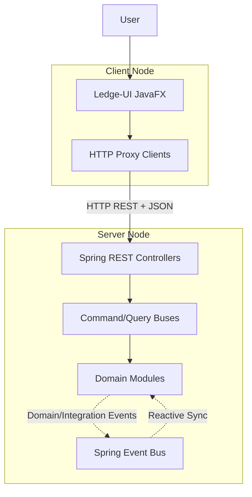
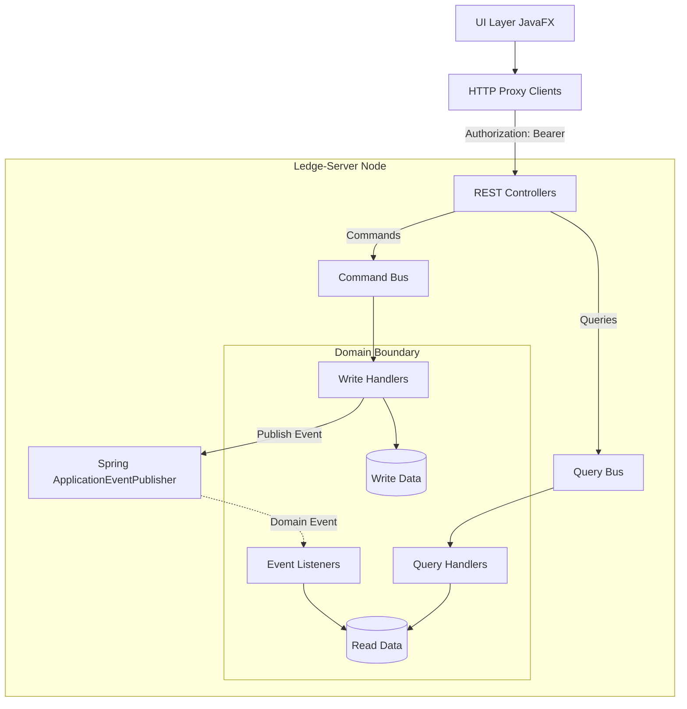

# System Architecture: Ledge Inventory Manager

This document outlines the architectural design of the Ledge Inventory Manager after its transition to a **Client-Server Distributed Architecture** using Spring Boot and JavaFX, and an **Event-Driven CQRS Synchronization** pattern.

## 1. Architectural Philosophy

The system is designed with a strong focus on separation of concerns, utilizing a decoupled infrastructure to ensure the frontend and backend can evolve independently:

*   **Distributed Client-Server**: The application is split into a standalone REST API (Server) and a desktop client (UI), communicating exclusively over HTTP.

*   **Contract-First Design**: Communication between layers is governed by dedicated Contract DTOs, ensuring binary independence between the client and the server internals.

*   **Command Query Responsibility Segregation (CQRS)**: Strict separation between state-mutating operations (Commands) and data-retrieval operations (Queries) within the server.

*   **Event-Driven Synchronization**: The Write side (Commands) and Read side (Queries) are decoupled via Domain Events. Cross-module side effects (e.g., Security reacting to User changes) are handled via Integration Events.

*   **Open Host Service (OHS)**: Formalized gateways for inter-module communication, ensuring that bounded contexts (Users, Security, Inventory) never reach into each other's internal repositories or domain services.

---

## 2. System Overview

One glance architecture diagram:

### Detailed Component Flow

---

## 3. Physical Module Breakdown

The project is structured as a Maven multi-module reactor with three distinct physical artifacts:

### `ledge-contracts`

The shared binary foundation. Contains only data and service definitions that both sides must agree on.

*   **DTOs**: All API Request and Response objects.

*   **Core Logic**: Shared infrastructure like the `EventBroker` and core security types (`Role`, `Permission`).

### `ledge-server`

A standalone Spring Boot application providing the business logic and persistence.

*   **REST Controllers**: Expose the domain to the network, translating HTTP headers (Tokens) into `AuthContext`.

*   **CQRS Interior**: Houses the Command/Query buses and all domain handlers.

*   **Reactive Synchronizers**: Listeners that handle Domain Events to update the JSON-based read repositories.

### `ledge-ui`

The JavaFX desktop client.

*   **HTTP Adapters**: Contains `HttpAuthClient`, `HttpInventoryClient`, etc., which proxy the UI's requests over the network.

*   **Presentation**: Pure FXML-based views and ViewModels for user interaction.

---

## 4. Inter-Module Communication

To maintain the purity of bounded contexts, modules follow two communication patterns:

1.  **Open Host Service (OHS)**:
    - Formal interfaces (e.g., `IUserService`) reside in the `api` package of a module.
    - External modules consume these interfaces rather than internal repositories.
2.  **Spring Application Events**:
    - **Domain Events**: Used for internal synchronization (e.g., updating a local Read Model).
    - **Integration Events**: Used for cross-context side-effects (e.g., Security assigning a default role when a user is registered).

---

## 5. Security & Authorization

Security remains fundamentally integrated into the Server-side dispatch infrastructure.

*   **Token-Based**: Upon login, the Server returns a token string. The Client stores this in the `SessionManager`.

*   **Bus-Level Guards**: Even if an endpoint is called via REST, the internal `CommandBus` and `QueryBus` re-verify permissions against the `AuthorizationService` before executing any logic.

*   **Exception Mapping**: Server-side `AuthorizationException` is automatically translated to HTTP 403 Forbidden by a `GlobalExceptionHandler`, allowing the UI to react.

---

## 6. Explicit Architectural Rules

1.  **Strict Module Isolation**: The `ledge-ui` module MUST NOT depend on `ledge-server`. It only interacts via the `ledge-contracts` and network calls.

2.  **No Direct Cross-Repo Access**: A module (e.g., Security) MUST NOT reach into another module's (e.g., Users) internal repository. It must go through an OHS or react to an event.

3.  **Command Purity**: Command Handlers should only focus on the primary domain action (Write side). All synchronization and side-effects must be handled reactively via published events.

4.  **Stateless API**: Every request must be self-describing via the Authorization header. No HTTP Sessions.