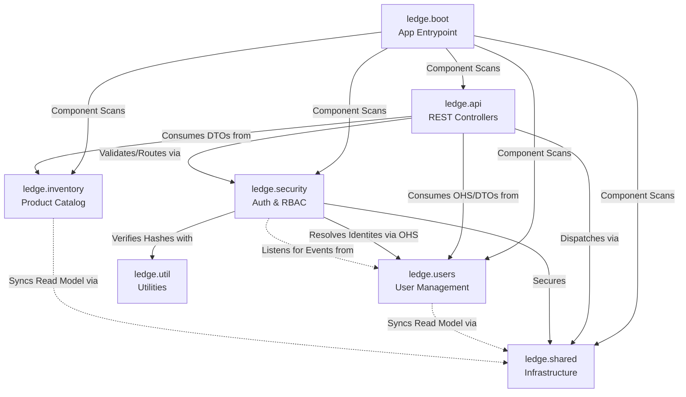
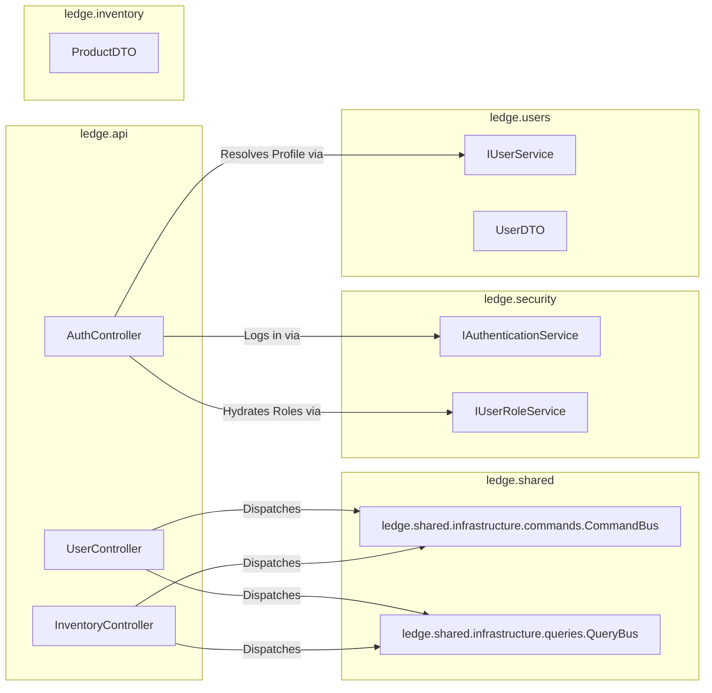
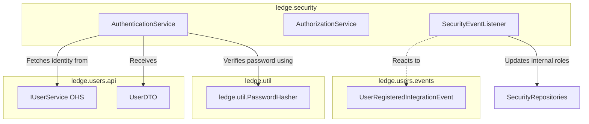
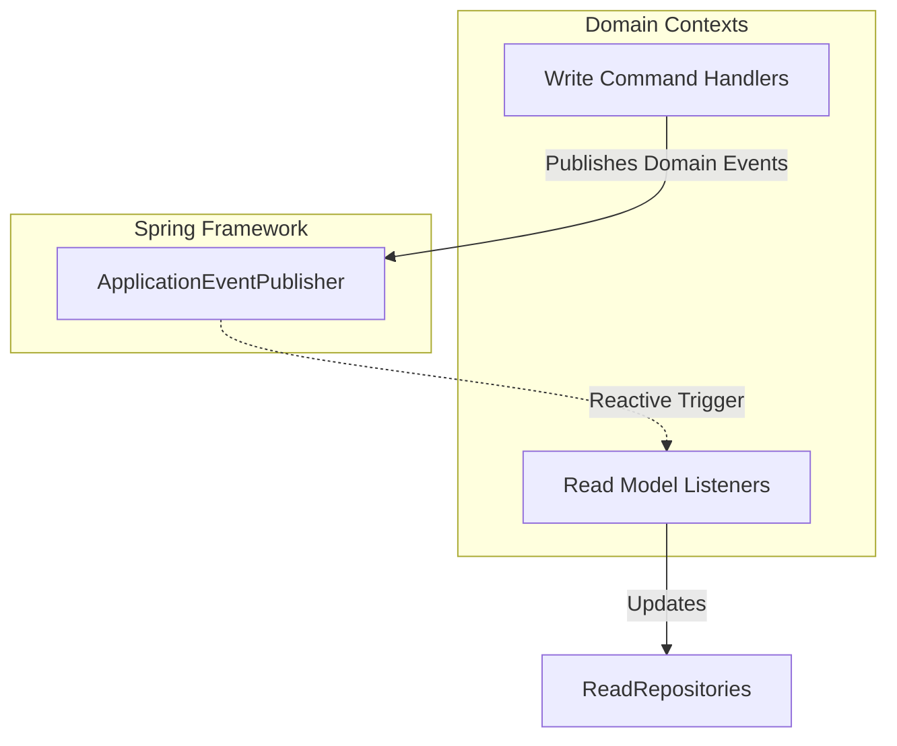

# Ledge Server Internal Dependencies

This document details the cross-package dependencies exclusively within the `ledge-server` module. It illustrates how different bounded contexts and architectural layers interact via formal OHS and Events.

## 1. High-Level Context Map

This diagram provides a bird's-eye view of how the primary packages within `ledge-server/src/main/java/ledge` interact with one another.

 

## 2. API Layer Internal Dependencies

The `ledge.api` package is responsible for accepting HTTP traffic and delegating work. Within the server, it depends strictly on the CQRS buses, the security OHS, and the domain OHS/DTOs of the respective modules.

 

## 3. Security Subsystem Dependencies

The `ledge.security` package acts as the bodyguard for the application. It relies on the Users OHS for identity verification and reacts to User events for role management.

 

## 4. Bounded Context Isolation (Events)

Both core bounded contexts (`users` and `inventory`) use Spring Events to decouple their Write side (Domain) from their Read side (Persistence).

