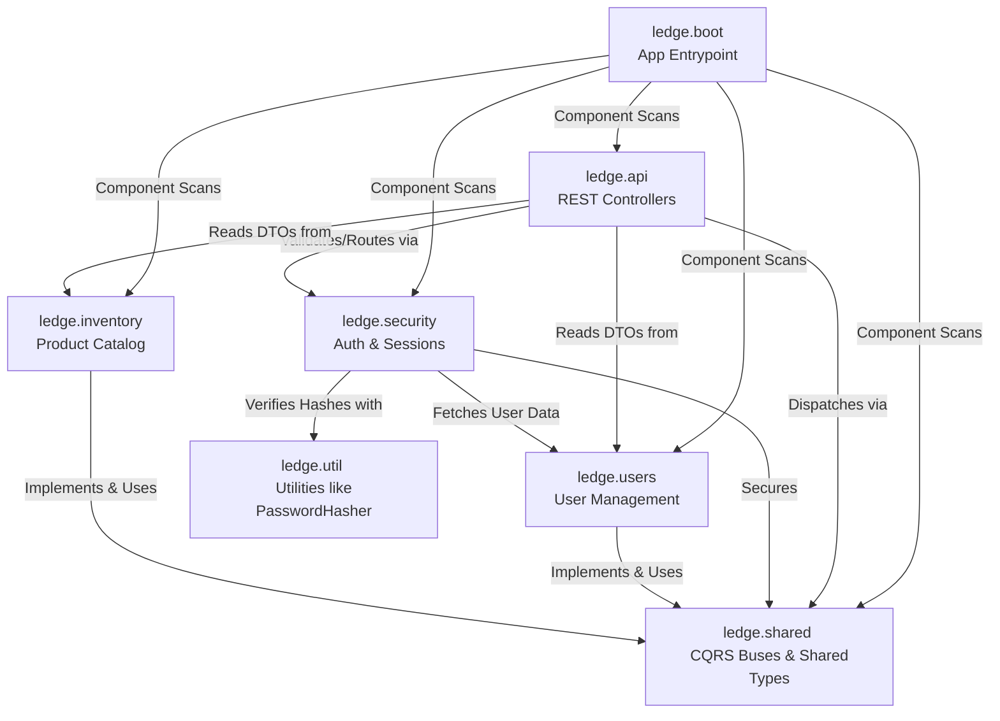
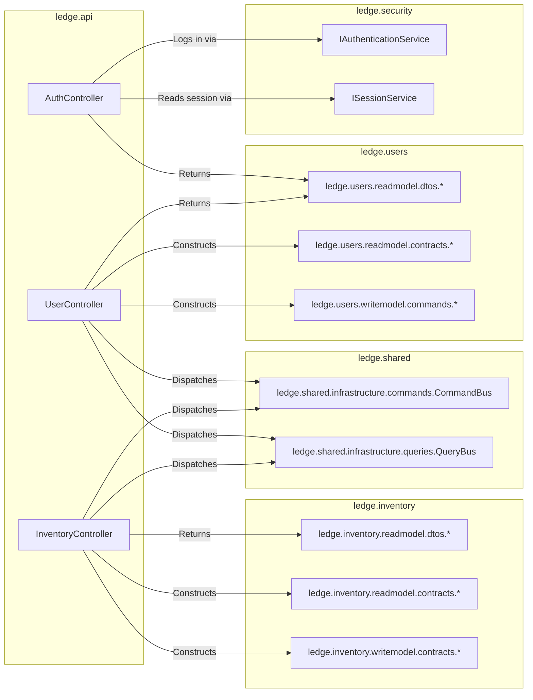
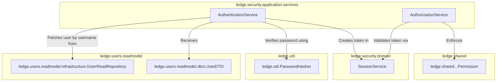
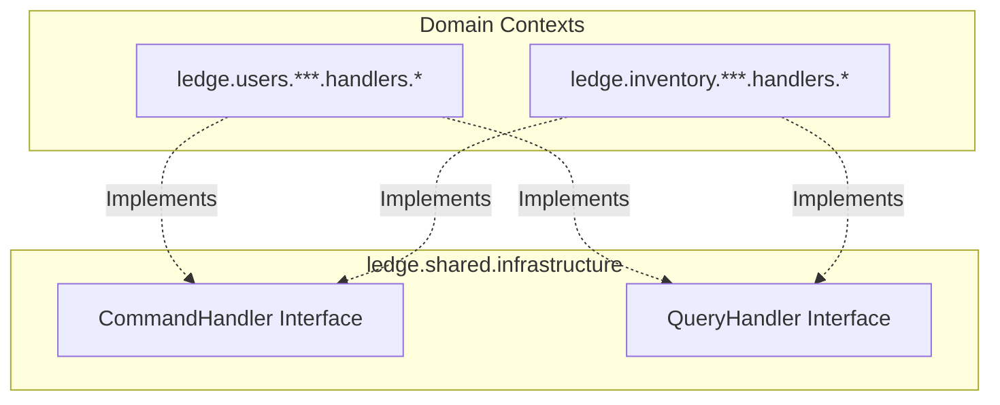

# Ledge Server Internal Dependencies

This document details the cross-package dependencies exclusively within the `ledge-server` module. It illustrates how different bounded contexts and architectural layers interact.

## 1. High-Level Context Map

This diagram provides a bird's-eye view of how the primary packages within `ledge-server/src/main/java/ledge` interact with one another.

 

## 2. API Layer Internal Dependencies

The `ledge.api` package is responsible for accepting HTTP traffic and delegating work. Within the server, it depends strictly on the CQRS buses, the security context, and the read-model DTOs/Contracts of the respective domain modules.

 

## 3. Security Subsystem Dependencies

The `ledge.security` package acts as the bodyguard for the application. It heavily relies on the `ledge.users` package to verify identities, highlighting an important dependency where security is a consumer of the user read-model.

 

## 4. Bounded Contexts -> Shared Infrastructure

Both core bounded contexts (`users` and `inventory`) rely heavily on the `ledge.shared` infrastructure packages to map handlers and enforce type safety.

