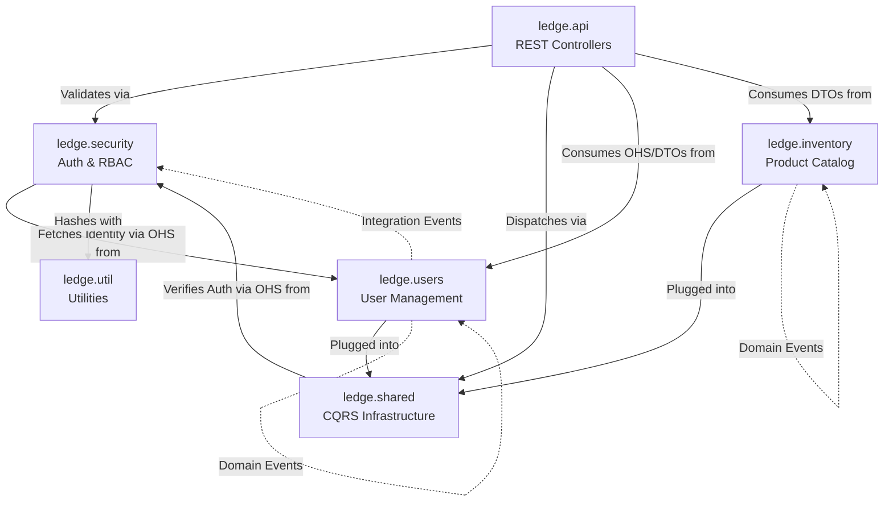

# Inter-Module Communication Reference

This document details the cross-package dependencies within the `ledge-server` module. It illustrates how different bounded contexts and architectural layers interact via formal **Open Host Services (OHS)** and **Domain Events**.

## 1. Context Map Overview

---

## 2. Detailed Dependencies

### 🔐 Security Context Dependencies (OHS & Events)
The `ledge.security` package acts as the bodyguard for the application. It exposes public APIs via OHS and reacts to integration events from other contexts.

- **`ledge.security.api.IAuthenticationService`** & **`IAuthorizationService`** (OHS)
    - Act as the formal entry points for auth-related logic.
- **`ledge.security.internal.application.SecurityEventListener`** (Event Consumer)
    - Listens for **`UserRegisteredIntegrationEvent`** to auto-assign default roles.
    - Listens for **`UserDeletedIntegrationEvent`** to clean up role records.

### 👥 Users Context Dependencies (OHS & Events)
The Users context is decoupled from both the Security context and its own Read Model via events.

- **`ledge.users.api.IUserService`** (OHS)
    - Provides a formal lookup gateway for internal identity resolution.
- **`ledge.users.readmodel.application.UserReadModelSyncListener`** (Event Consumer)
    - Synchronizes the Read Model reactively to Domain Events (Created, Changed, Deleted).

### 📦 Inventory Context Dependencies (Events)
The Inventory module achieves internal Read/Write decoupling via events.

- **`ledge.inventory.readmodel.application.ProductReadModelSyncListener`** (Event Consumer)
    - Synchronizes Product Read Model reactively to Domain Events (Created, Updated, Removed).
- **Isolation**: Inventory is currently 100% isolated from other domain modules (Users/Security).

### 🚌 Shared Infrastructure Dependencies
The CQRS buses are the primary dispatchers. They are "Security-Aware" and intercept every request to verify permissions via the Security OHS.

- **`ledge.shared.infrastructure.commands.CommandBus`**
    - uses **`ledge.security.api.IAuthorizationService`** (interceptor).
- **`ledge.shared.infrastructure.queries.QueryBus`**
    - uses **`ledge.security.api.IAuthorizationService`** (interceptor).

---

## 3. Data Flow Example: User Registration

1. **`ledge.api.users.UserController`** receives registration request.
2. Dispatches **`AddUserCommand`** via `CommandBus`.
3. Bus calls **`IAuthorizationService`** to verify permissions (e.g., `USER:CREATE`).
4. **`AddUserCommandHandler`** executes:
    - Saves user to `IUserWriteRepository`.
    - Publishes **`UserCreatedDomainEvent`** (Local Sync).
    - Publishes **`UserRegisteredIntegrationEvent`** (Global Sync).
5. **`UserReadModelSyncListener`** (Users Context) updates the `IUserReadRepository`.
6. **`SecurityEventListener`** (Security Context) assigns the `DEFAULT_USER` role.
7. Controller returns success response.
