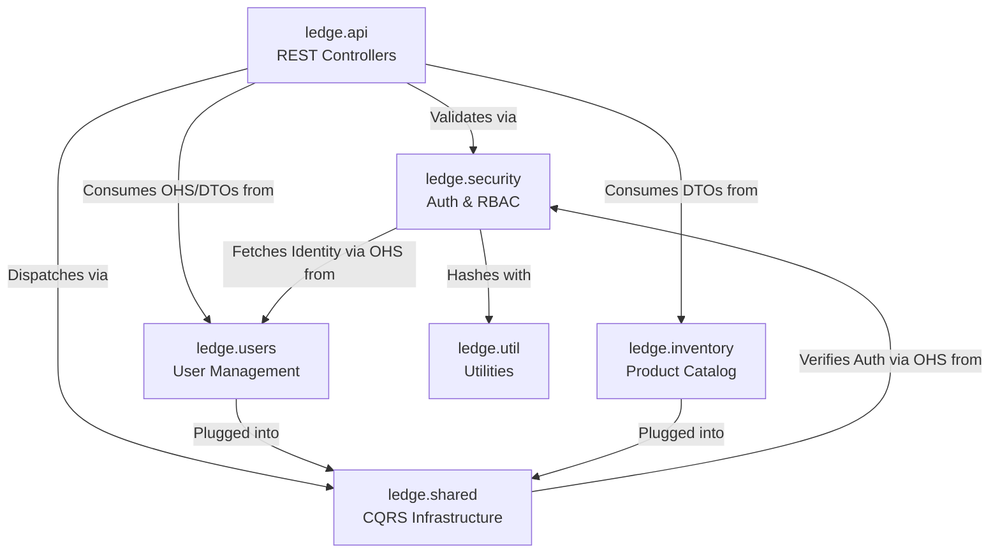

# Inter-Module Communication Reference

This document details the cross-package dependencies within the `ledge-server` module. It illustrates how different bounded contexts and architectural layers interact via formal **Open Host Services (OHS)**.

## 1. Context Map Overview

---

## 2. Detailed Dependencies

### 🔐 Security Context Dependencies (OHS)
The `ledge.security` package acts as the bodyguard for the application. Its public API is exposed through the **`IAuthenticationService`** and **`IAuthorizationService`** OHS.

- **`ledge.security.internal.application.AuthenticationService`** 
    - uses **`ledge.users.api.IUserService`** (OHS) to resolve identities for login.
    - uses **`ledge.util.PasswordHasher`** (to verify credentials).
- **`ledge.api.auth.AuthController`** (Part of API context, consumers of Security OHS)
    - uses **`ledge.security.api.IAuthenticationService`** (to login/logout and resolve tokens).
    - uses **`ledge.security.api.IUserRoleService`** (to fetch role assignments).
    - uses **`ledge.users.api.IUserService`** (OHS) to fetch user profiles by ID (Me/Login flows).

*Note: AuthController no longer depends on the internal ISessionService.*

### 👥 Users Context Dependencies (OHS)
The `ledge.users` package exposes its functionality via the **`IUserService`** OHS for other modules to consume without reaching into its persistence or domain layers.

- **`ledge.users.api.IUserService`** (Open Host Service)
    - Consumed by **`AuthenticationService`** for login verification.
    - Consumed by **`AuthController`** for identity resolution.

### 🚌 Shared Infrastructure Dependencies
The CQRS buses are the primary dispatchers. They are "Security-Aware" and intercept every request to verify permissions via the Security OHS.

- **`ledge.shared.infrastructure.commands.CommandBus`**
    - uses **`ledge.security.api.IAuthorizationService`** (interceptor).
- **`ledge.shared.infrastructure.queries.QueryBus`**
    - uses **`ledge.security.api.IAuthorizationService`** (interceptor).

---

## 3. Data Flow Example: User Login

1. **`ledge.api.auth.AuthController`** receives request.
2. Calls **`ledge.security.api.IAuthenticationService.login()`**.
3. Service calls **`ledge.users.api.IUserService.getUserByUsername()`** (OHS).
4. Service compares password using **`ledge.util.PasswordHasher`**.
5. Controller calls **`ledge.security.api.IAuthenticationService.getUserIdByToken()`** (OHS).
6. Controller calls **`ledge.users.api.IUserService.getUserById()`** (OHS) to fetch the user profile.
7. Controller calls **`ledge.security.api.IUserRoleService.getRoleId()`** to hydrate roles.
8. Returns unified response.
